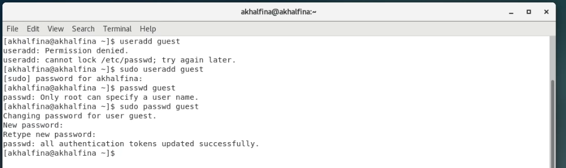
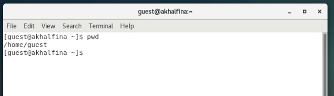
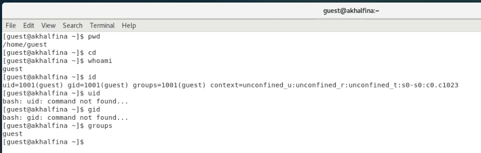
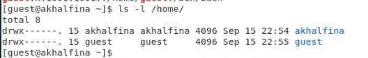
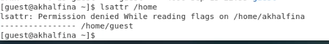
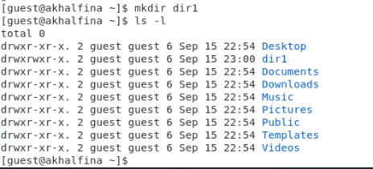
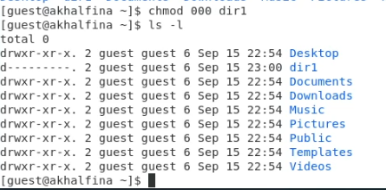
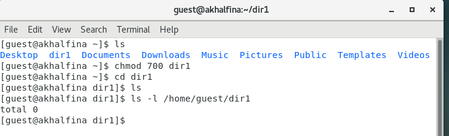

# Информационная безопасность

## Лабораторная работа №2

## Дискреционное разграничение прав в Linux. Основные атрибуты

---
**Выполнила:** Халфина Айсылу Зуфаровна

**Группа:** НПМбд-02-19

08.09.2022

---

## Цель работы

1) Получение практических навыков работы в консоли с атрибутами файлов;
2) Закрепление теоретических основ дискреционного разграничения доступа в современных системах с открытым кодом на 
   базе ОС Linux.

## Выполнение

Первым делом нам необходимо создать нового пользователя под именем **guest** и задать для него пароль. (Рис. 1)

Далее перезайдём в систему уже под новым пользователем. Откроем терминал и с помощью команды **pwd** проверим в 
какой директории находимся. Видим что это наша домашняя директория. (Рис. 2)

Проверим имя текущего пользователя при помощи команды **whoami**. Затем просмотрим сводную информацию по нашему 
пользователю с помощью команды **id**. Видим что ID пользователя и ID группы соответствуют 1001. Так же просмотрим 
информацию по команде **groups**. Видим что по команде **id** вывод гораздо более полный. Команда **groups** 
показывает лишь имя группы, в которую входит пользователь. Так же можем заметить, что то, под каким пользователем мы 
сейчас залогинены, можно определить по командной строке. (Рис. 3)

Теперь просмотрим запись о нашем пользователе в файле **passwd**. Для удобства выведем только интересующую нас 
строку при помощи команды **cat /etc/passwd | grep guest** (Рис. 4)

Просмотрим существующие в системе директории при помощи команды **ls -l /home/**. Видим две директории, 
соответствующие нашим пользователям. На каждую выставлены права на чтение, запись и исполнение. 
(Рис. 5)

Теперь просмотрим расширенные атрибуты, установленные на поддиректориях. (Рис. 6)

Далее создадим директорию **dir1** и проверим выставленные на неё права доступа (Рис. 7)

Снимем с директории все атрибуты и проверим результат. (Рис. 8)

Попробуем создать файл. Видим что файл не создался из-за нехватки прав доступа (Рис. 9)

Проверим действительно ли файл не создался. Для этого нам необходимо добавить права на папку. Видим что в папке 
пусто и файл действительно не создался. (Рис. 10)

Разный набор прав позволяет совершать разные действия с директориями и файлами. В таблице 1 приведены примеры 
действий, доступных при наличии тех ил иных прав.

## Таблица 1. Установленные права и разрешённые действия

| Права директории |   Права файла    | Создание файла | Удаление файла | Запись в файл | Чтение файла | Смена директории | Просмотр файлов в директории | Переименование файла | Смена атрибутов файла |
|:----------------:|:----------------:|----------------|----------------|---------------|--------------|------------------|------------------------------|----------------------|-----------------------|
|     d (000)      |      -(000)      | —              | —              | —             | —            | —                | —                            | —                    | —                     |
| d--x------ (100) | ----------(000)  | —              | —              | —             | —            | +                | —                            | —                    | +                     |
| d-w------- (200) | ----------(000)  | +              | —              | —             | —            | —                | —                            | +                    | —                     |
| dr-------- (400) | ----------(000)  | —              | —              | —             | —            | —                | +                            | —                    | —                     |
| drwx------ (700) | ----------(000)  | +              | —              | —             | —            | +                | +                            | +                    | +                     |
| d--x------ (100) | ---x------ (100) | —              | —              | —             | —            | +                | —                            | —                    | +                     |
| d--x------ (100) | --w------- (200) | —              | +              | +             | +            | +                | —                            | —                    | +                     |
| d--x------ (100) | -r-------- (400) | —              | —              | —             | +            | +                | —                            | —                    | +                     |
| d--x------ (100) | -rwx------ (700) | —              | +              | +             | +            | +                | —                            | —                    | +                     |
| d-w------- (200) | ---x------ (100) | +              | —              | —             | —            | —                | —                            | +                    | —                     |
| d-w------- (200) | --w------- (200) | +              | +              | +             | +            | —                | —                            | +                    | —                     |
| d-w------- (200) | -r-------- (400) | +              | —              | —             | +            | —                | —                            | +                    | —                     |
| d-w------- (200) | -rwx------ (700) | +              | +              | +             | +            | —                | —                            | +                    | —                     |
| dr-------- (400) | ---x------ (100) | —              | —              | —             | —            | —                | +                            | —                    | —                     |
| dr-------- (400) | --w------- (200) | —              | +              | +             | +            | —                | +                            | —                    | —                     |
| dr-------- (400) | -r-------- (400) | —              | —              | —             | +            | —                | +                            | —                    | —                     |
| dr-------- (400) | -rwx------ (700) | —              | +              | +             | +            | —                | +                            | —                    | —                     |
| drwx------ (700) | ---x------ (100) | +              | —              | —             | —            | +                | +                            | +                    | +                     |
| drwx------ (700) | --w------- (200) | +              | +              | +             | +            | +                | +                            | +                    | +                     |
| drwx------ (700) | -r-------- (400) | +              | —              | —             | +            | +                | +                            | +                    | +                     |
| drwx------ (700) | -rwx------ (700) | +              | +              | +             | +            | +                | +                            | +                    | +                     |

В таблице 2 представлены минимальные наборы прав, для совершения тех или иных действий.

## Таблица 2. Минимальные права для совершения операций

| Операция               | Минимальные права на директорию   | Минимальные права на файл  |
|------------------------|-----------------------------------|----------------------------|
| Создание файла         | d-w-------                        | ----------                 |
| Удаление файла         | d---------                        | --w-------                 |
| Чтение файла           | d---------                        | -r--------                 |
| Запись в файл          | d---------                        | --w-------                 |
| Переименование файла   | d-w-------                        | ----------                 |
| Создание поддиректории | d-w-------                        | ----------                 |
| Удаление поддиректории | d-w-------                        | ----------                 |

## Выводы

В ходе выполнения работы была получены практические навыки работы с правами доступа файлов и папок.
