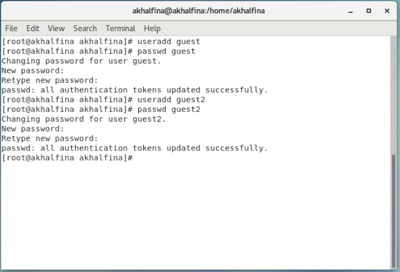
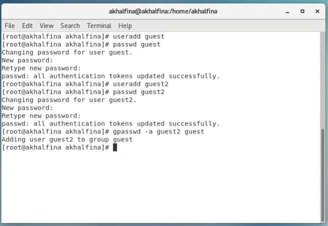
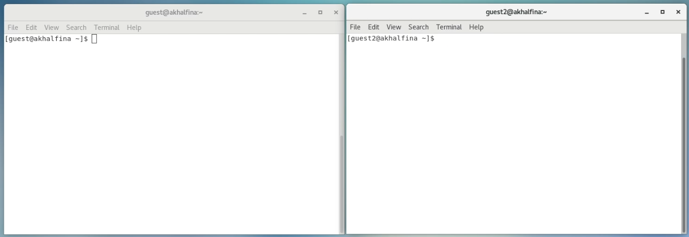
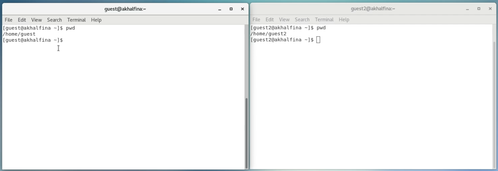
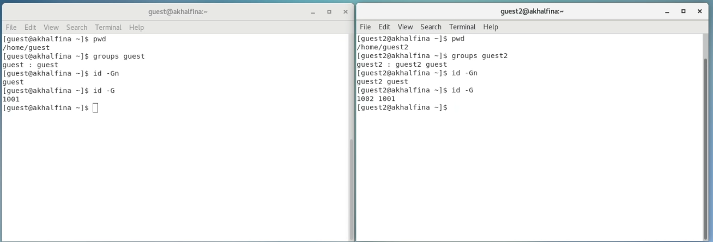
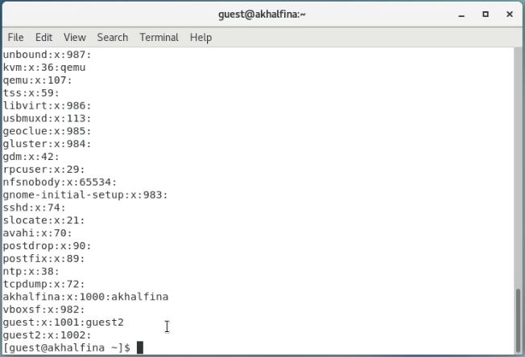
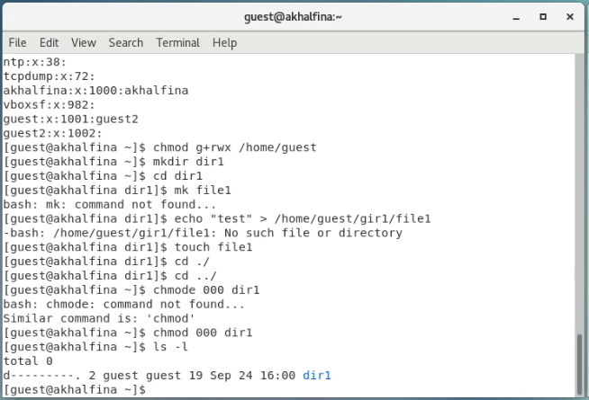

# Информационная безопасность

## Лабораторная работа №3

## Дискреционное разграничение прав в Linux. Два пользователя

---
**Выполнила:** Халфина Айсылу Зуфаровна

**Группа:** НПМбд-02-19

08.09.2022

---

## Цель работы

Получение практических навыков работы в консоли с атрибутами файлов для групп пользователей.

## Выполнение

Первым делом нам необходимо создать пользователей **guest** и **guest2**. (Рис. 1)

Затем добавим пользователя **guest2** а группу **guest** (Рис. 2)

Теперь осуществим вход от имени пользователей **guest** и **guest2** в двух отдельных терминалах (Рис. 3)

При помощи команды **pwd** убедимся, что мы находимся в правильных домашних директориях (Рис. 4)

Выведем информацию о группах пользователей. Видим что пользователь **guest2** состоит в группах **guest** и **guest2** 
(Рис. 5)

Так же выведем информацию о всех группах командой **cat/etc/group** (Рис. 6)

Теперь, от имени пользователя **guest**, изменим права директории /home/guest, разрешив все действия для 
пользователей группы. Так же снимем все атрибуты с директории dir1. И проверим правильность снятия атрибутов 
командой **ls - l** (Рис. 6)

## Таблица 1. Установленные права и разрешённые действия

| Права директории | Права файла  | Создание файла | Удаление файла | Запись в файл | Чтение файла | Смена директории | Просмотр файлов в директории | Переименование файла | Смена атрибутов файла |
|:--------------------:|:----------------:|--------------------|--------------------|-------------------|------------------|----------------------|--------------------------------------|--------------------------|-------------------------------|
|       d (000)        |      -(000)      | —                  | —                  | —                 | —                | +                    | —                                    | —                        | —                             |
|   d-----x--- (010)   | ---------- (000) | —                  | —                  | —                 | —                | +                    | —                                    | —                        | —                             |
|   d-----x--- (010)   | ------x--- (010) | —                  | —                  | +                 | —                | +                    | —                                    | —                        | —                             |
|   d-----x--- (010)   | -----w---- (020) | —                  | —                  | +                 | —                | +                    | —                                    | —                        | —                             |
|   d-----x--- (010)   | -----wx--- (030) | —                  | —                  | —                 | +                | +                    | —                                    | —                        | —                             |
|   d-----x--- (010)   | ----r----- (040) | —                  | —                  | —                 | +                | +                    | —                                    | —                        | —                             |
|   d-----x--- (010)   | ----r-x--- (050) | —                  | —                  | +                 | +                | +                    | —                                    | —                        | —                             |
|   d-----x--- (010)   | ----rw---- (060) | —                  | —                  | +                 | +                | +                    | —                                    | —                        | —                             |
|   d-----x--- (010)   | ----rwx--- (070) | —                  | —                  | —                 | —                | +                    | —                                    | —                        | —                             |
|   d----w---- (020)   | ---------- (000) | —                  | —                  | —                 | —                | —                    | —                                    | —                        | —                             |
|   d----w---- (020)   | ------x--- (010) | —                  | —                  | —                 | —                | —                    | —                                    | —                        | —                             |
|   d----w---- (020)   | -----w---- (020) | —                  | —                  | —                 | —                | —                    | —                                    | —                        | —                             |
|   d----w---- (020)   | -----wx--- (030) | —                  | —                  | —                 | —                | —                    | —                                    | —                        | —                             |
|   d----w---- (020)   | ----r----- (040) | —                  | —                  | —                 | —                | —                    | —                                    | —                        | —                             |
|   d----w---- (020)   | ----r-x--- (050) | —                  | —                  | —                 | —                | —                    | —                                    | —                        | —                             |
|   d----w---- (020)   | ----rw---- (060) | —                  | —                  | —                 | —                | —                    | —                                    | —                        | —                             |
|   d----w---- (020)   | ----rwx--- (070) | —                  | —                  | —                 | —                | —                    | —                                    | —                        | —                             |

В таблице 2 представлены минимальные наборы прав, для совершения тех или иных действий.

## Таблица 2. Минимальные права для совершения операций

| Операция               | Минимальные права на директорию | Минимальные права на файл |
|------------------------|-------------------------------------|-------------------------------|
| Создание файла         | d----wx---                          | ----------                    |
| Удаление файла         | d----wx---                          | ----------                    |
| Чтение файла           | d-----x---                          | ----r-----                    |
| Запись в файл          | d----wx---                          | ----------                    |
| Переименование файла   | d----wx---                          | ----------                    |
| Создание поддиректории | d----wx---                          | ----------                    |
| Удаление поддиректории | d----wx---                          | ----------                    |

## Выводы

В ходе выполнения работы была получены практические навыки работы с правами доступа файлов и папок для групп 
пользователей.
