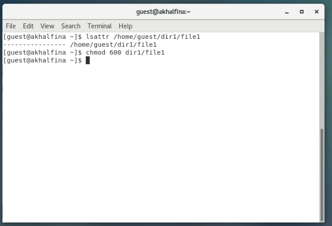
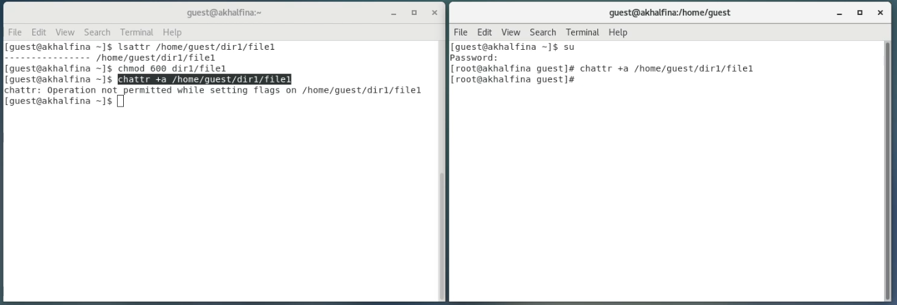
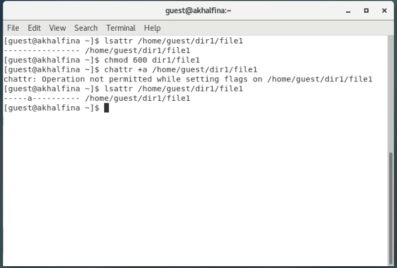
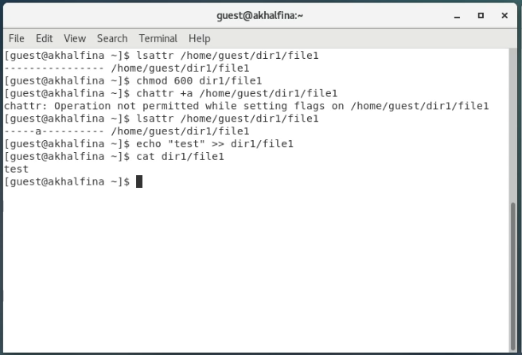
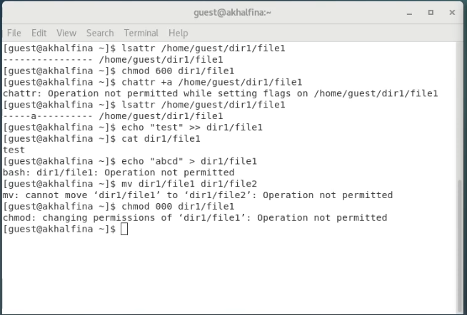
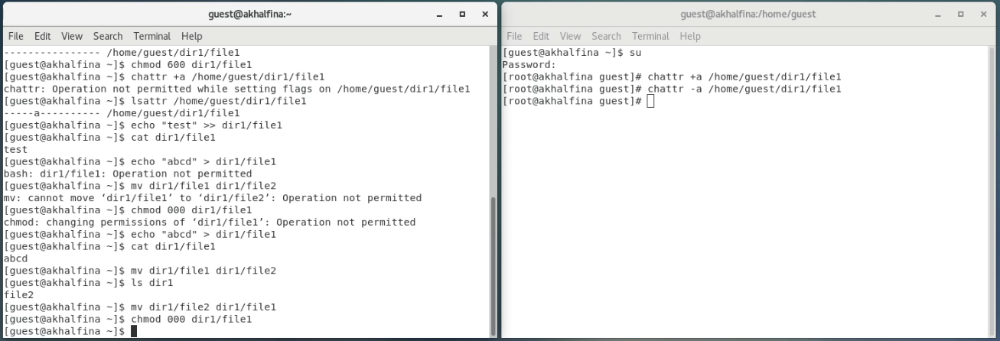
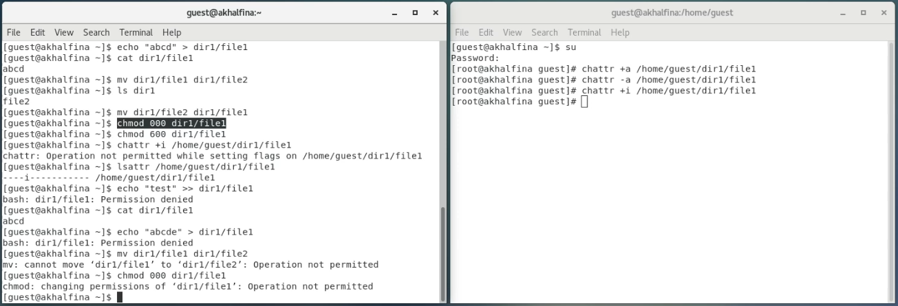

# Информационная безопасность

## Лабораторная работа №4

## Дискреционное разграничение прав в Linux. Расширенные атрибуты

---
**Выполнила:** Халфина Айсылу Зуфаровна

**Группа:** НПМбд-02-19

08.09.2022

---

## Цель работы

Получение практических навыков работы в консоли с расширенными атрибутами файлов.

## Выполнение

Сперва от имени пользователя **guest** определим расширенные атрибуты файла **file1**. Видим что у файла не 
установленно никаких атрибутов. Установим на файл права, разрешающие чтение и запись для владельца. (Рис. 1)

Попробуем установить на файл расширенный атрибут **a** от имени пользователя **guest**. Видим сообщение об ошибке. 
Запускаем ещё одно окно терминала и переключаемся на **root** пользователя командой **su**. Пробуем установить тот 
же атрибут из под администратора. (Рис. 2)

От имени пользователя **guest** проверяем правильность выставления атрибута. (Рис. 3)

Добавим в конец файла слово **test**. Проверим что запись прошла успешно с помощью команды **cat** (Рис. 4)

Теперь попробуем заменить текст полностью, переименовать файл и изменить его права. Видим что ни одна из этих 
операций не была выполнена. Всё потому, что атрибут **a** позволяет только добавлять текст в конец файла (Рис. 5)

Уберём атрибут **a** от имени администратора и попробуем повторить все те операции, которые у нас не сработали. 
Видим, что теперь файл возможно перезаписать, переименовать и изменить установленные на него права доступа. (Рис. 6)

Теперь установим на файл от имени администратора атрибут **i** и попробуем повторить все те же действия. Видим, что 
ни одно из них выполнить не удаётся. Всё потому, что атрибут **i** делает файл неизменяемым. (Рис. 7)

## Выводы

В результате выполнения работы, мы получили практические навыки работы с расширенными атрибутами файлов.
