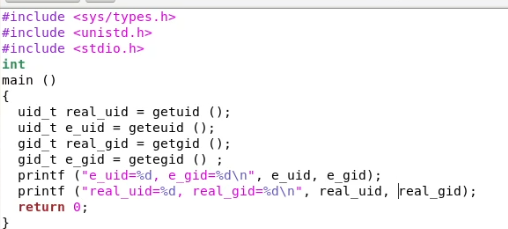

# Информационная безопасность

## Лабораторная работа №5

## Дискреционное разграничение прав в Linux. Исследование влияния дополнительных атрибутов

---
**Выполнила:** Халфина Айсылу Зуфаровна

**Группа:** НПМбд-02-19

08.10.2022

---

## Цель работы

Изучение механизмов изменения идентификаторов, применения SetUID- и Sticky-битов. Получение практических навыков 
работы в консоли с дополнительными атрибутами. Рассмотрение работы механизма смены идентификатора процессов 
пользователей, а также влияние бита Sticky на запись и удаление файлов.

## Выполнение
### 1) Создание программы

Сперва создадим программу **simpleid.c**

Скомпилируем программу и убедимся, что файл программы создан. Выполним программу **simpleid** и системную программу 
**id**. Видим что программа отображает идентификаторы пользователя и группы корректно.

Усложним программу, добавив вывод действительных идентификаторов. Назовём программу **simpleid2.c**

Скомпилируем и запустим **simpleid2.c**

Сменим владельца файла и выставим ему SetU’D-бит. Проверим правильность смены атрибутов. Запустим программу и 
выполним команду **id**

### 2) Исследование Sticky-бита

Выясним, установлен ли атрибут Sticky на директории **/tmp**. От имени пользователя guest создайте файл file01.txt в 
директории **/tmp** со словом **test**. Просмотрите атрибуты у только что созданного файла и разрешите чтение и 
запись для категории пользователей «все остальные».

От пользователя **guest2** (не являющегося владельцем) попробуем прочитать файл **/tmp/file01.txt**, дозаписать 
слово **test2**. Так же попробуем записать в фай слово test3, стерев при этом всю имеющуюся в файле информацию. 
Затем попробуем удалить файл. Видим что все операции, кроме удаления, выполнились успешно.

Повысим свои права до суперпользователя и снимем с директории атрибут **t**. Попробуем повторить все те же операции. 
Видим что на этот раз все они были выполнены успешно.

## Выводы

В результате выполнения работы, мы изучили механизмы изменения идентификаторов, применения SetUID- и Sticky-битов, 
получили практические навыки работы в консоли с дополнительными атрибутами, рассмотрел работу механизма смены 
идентификатора процессов пользователей, а также влияние бита Sticky на запись и удаление файлов.
