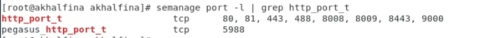

# Информационная безопасность

## Лабораторная работа №6

## Мандатное разграничение прав в Linux

---
**Выполнила:** Халфина Айсылу Зуфаровна

**Группа:** НПМбд-02-19

14.10.2022

---

## Цель работы

Развить навыки администрирования ОС Linux. Получить первое практическое знакомство с технологией SELinux1.
Проверить работу SELinx на практике совместно с веб-сервером Apache.

## Выполнение

Проверим включен ли режим **enforcing** и политика **targeted**. Проверим что вебсервер работает с помощию команды 
**service httpd status**. 

Определим контекст безопасности процесса **Apache**. 

Просмотрим статистику по политике с помощью **seinfo**.

Создадим файл **test.html** и проверим что он открывается в браузере.

Проверим контекст файла. Сменим его на **samba_share_t**

Попробуем открыть снова открыть файл. Видим сообщение, что доступ запрещён. Просмотрим ошибку в логах.

Переключим **Apache** на прослушивание порта **81**. Просмотрим список портов командой **semanage port -l | grep 
http_port_t**

Попробуем теперь открыть файл с указанием порта **81**.

## Выводы

Мы получили первое практическое знакомство с технологией SELinux1. Проверили работу SELinx на практике совместно с 
веб-сервером Apache.
