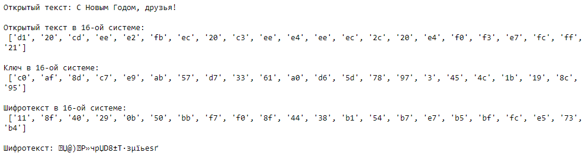
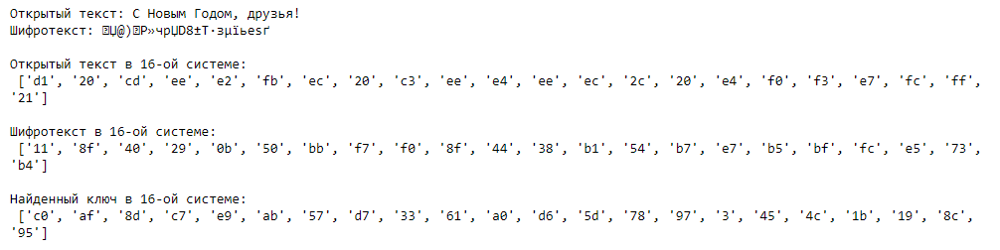
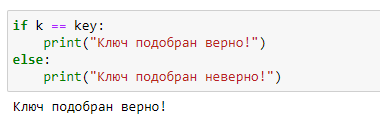

# Информационная безопасность

## Лабораторная работа №7

## Элементы криптографии. Однократное гаммирование


---
**Выполнила:** Халфина Айсылу Зуфаровна

**Группа:** НПМбд-02-19

22.10.2022

---

## Цель работы
Освоить на практике применение режима однократного гаммирования.

## Выполнение

Сперва импортируем библиотеку **numpy**

```
import numpy as np
```
Напишем функцию, получающую на вход строку. Внутри функции переводим её в шестнадцатеричную систему счисления. После 
случайным образом генерируем ключ. При помощи ключа получаем зашифрованное сообщение в шестнадцатеричной СС. Затем 
переводим это сообщение в строковый вид.

```
def encrypt(text):
    print("Открытый текст:", text)
    new_text = []
    for i in text:
        new_text.append(i.encode("cp1251").hex())
    print("\nОткрытый текст в 16-ой системе:\n", new_text)
    
    r = np.random.randint(0, 255, len(text))
    key = [hex(i)[2: ] for i in r]
    print("\nКлюч в 16-ой системе:\n", key)
    
    xor_text = []
    for i in range(len(new_text)):
        xor_text.append("{:02x}".format(int(key[i], 16) ^ int(new_text[i], 16)))
    print("\nШифротекст в 16-ой системе:\n", xor_text)
    
    en_text = bytearray.fromhex("".join(xor_text)).decode("cp1251")
    print("\nШифротекст:", en_text)
    
    return key, en_text
```

Вызовем функцию и проверим ей работу на примере текста "С Новым Годом, друзья!"

```
t = "С Новым Годом, друзья!"
k, et = encrypt(t)
```



Далее напишем функцию по поиску ключа. Функция получает на вход две строки: исходный (открытый) текст и 
зашифрованный. Затем она преобразует оби строки в шестнадцатеричный формат и выполняет операцию XOR для нахождения 
ключа.

```
def find_key(text, en_text):
    print("Открытый текст:", text, "\nШифротекст:", en_text)
    
    new_text = []
    for i in text:
        new_text.append(i.encode("cp1251").hex())
    print("\nОткрытый текст в 16-ой системе:\n", new_text)
    
    tmp_text = []
    for i in en_text:
        tmp_text.append(i.encode("cp1251").hex())
    print("\nШифротекст в 16-ой системе:\n", tmp_text)
    
    key = [hex(int(k, 16) ^ int(t, 16))[2:] for (k, t) in zip(new_text, tmp_text)]
    print("\nНайденный ключ в 16-ой системе:\n", key)
    
    return key
```

Вызовем функцию и получим подобранный ключ.

```
key = find_key(t, et)
```



Проверим правильность нахождения ключа.



## Контрольные вопросы:

1. Поясните смысл однократного гаммирования. Однократное граммирование представляет собой наложение на открытые 
   данные последовательности элементов других данных, полученной с помощью криптографического алгоритма, для 
   получения зашифрованных данных.
2. Перечислите недостатки однократного гаммирования. Абсолютная стойкость шифра доказана только для 
   случая, когда однократно используемый ключ, длиной, равной длине исходного сообщения, является фрагментом истинно 
   случайной двоичной последовательности с равномерным законом распределения.
3. Перечислите преимущества однократного гаммирования. Во-первых, такой способ симметричен, т.е. двойное прибавление 
   одной и той же величины по модулю 2 восстанавливает исходное значение. Во-вторых, шифрование и расшифрование 
   может быть выполнено одной и той же программой. Наконец, Криптоалгоритм не даёт никакой информации об открытом 
   тексте: при известном зашифрованном сообщении C все различные ключевые последовательности K возможны и 
   равновероятны, а значит, возможны и любые сообщения P.
4. Почему длина открытого текста должна совпадать с длиной ключа? Если ключ короче текста, то операция XOR будет 
   применена не ко всем элементам и конец сообщения будет не закодирован. Если ключ будет длиннее, то появится 
   неоднозначность декодирования.
5. Какая операция используется в режиме однократного гаммирования, назовите её особенности? Операция XOR 
   используется в режиме однократного гаммирования. Наложение гаммы по сути представляет собой выполнение побитовой 
   операции сложения по модулю 2, т.е. мы должны сложить каждый элемент гаммы с соответствующим элементом ключа. 
   Данная операция является симметричной, так как прибавление одной и той же величины по модулю 2 восстанавливает 
   исходное значение.
6. Как по открытому тексту и ключу получить шифротекст? Ci = Pi ⊕ Ki
7. Как по открытому тексту и шифротексту получить ключ? Ki = Pi ⊕ Ci
8. В чем заключаются необходимые и достаточные условия абсолютной стойкости шифра? Полная случайность ключа, 
   равенство длин ключа и открытого текста, однократное использование ключа.

## Выводы

В ходе выполнения лабораторной работы мы освоили на практике режим однократного граммирования.
