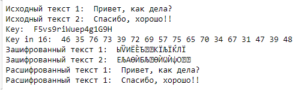

# Информационная безопасность

## Лабораторная работа №8

## Элементы криптографии. Шифрование (кодирование) различных исходных текстов одним ключом


---
**Выполнила:** Халфина Айсылу Зуфаровна

**Группа:** НПМбд-02-19

22.10.2022

---

## Цель работы

Освоить на практике применение режима однократного гаммирования на примере кодирования различных исходных текстов 
одним ключом.

## Задание

Два текста кодируются одним ключом. Требуется не зная ключа и не стремясь его определить, прочитать оба текста. 
Необходимо разработать приложение, позволяющее шифровать и дешифровывать тексты в режиме однократного граммирования. 
Приложение должно определить вид шифротекстов обоих текстов при известном ключе. Необходимо определить и выразить 
аналитически способ, при котором злоумышленник может прочитать оба текста, не зная ключа и не стремясь его определить.

## Выполнение

Первым делом ипортируем необходимые библиотеки.

```
import string
import random
```

Затем напишем функцию формирования ключа.

```
def key(size):
    key1 = ''.join(random.choice(string.ascii_letters + string.digits) for _ in range(size))
    print("Key: ", key1)
    key2 = coding(key1)
    print("Key in 16: ", key2)
    return key2
```

Функцию перевода данных в шестнадцатеричную систему.

```
def coding(text):
    new_text = ' '.join(hex(ord(i))[2:] for i in text)
    return new_text
```

И функцию шифрования текста.

```
def crypt(text, key):
    t = [ord(i) for i in text]
    k = [ord(j) for j in key]
    crypted = ''.join(chr(i^j) for i,j in zip(t,k))
    return crypted
```

Зашифруем и дешифруем тексты в режиме однократного граммирования.

```
text_1 = "Привет, как дела?"
text_2 = "Спасибо, хорошо!!"

print("Исходный текст 1: ", text_1)
print("Исходный текст 2: ", text_2)

key = key(len(text_1))

ct1 = crypt(text_1, key)
ct2 = crypt(text_2, key)
print("Зашифрованный текст 1: ", ct1)
print("Зашифрованный текст 2: ", ct2)

decrypt = crypt(ct1, ct2)
dt1 = crypt(decrypt, text_2)
dt2 = crypt(decrypt, text_1)

print("Расшифрованный текст 1: ", dt1)
print("Расшифрованный текст 1: ", dt2)
```



## Выводы

В ходе выполнения работы мы освоили на практике применение режима однократного граммирования на примере кодирования 
различных исходных текстов одним ключом.
