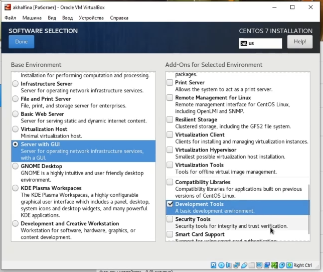

# Информационная безопасность

## Лабораторная работа №1

## Работа с виртуальной машиной 

---
**Выполнила:** Халфина Айсылу Зуфаровна

**Группа:** НПМбд-02-19

08.09.2022

---

## Цель работы

1) приобретение практических навыков установки
операционной системы на виртуальную машину
2) настройка минимально необходимых для дальнейшей работы сервисов.

#3
## Выполнение

Первым шагом создаём нашу виртуальную машину. Задаём ей имя, указываем папку для установки,
выбираем тип и версию системы, указываем объём доступной оперативной памяти
и объём доступного места на диске (Рис. 1)

Добавляем носитель с нашим образом системы (Рис. 2)

После этого нажимаем кнопку "Запустить" и дожидаемся запуска программы установки.
На первом шаге выберем язык системы по умолчанию. (Рис. 3)

Затем настраиваем часовой пояс. (Рис. 4)

Так же настраиваем раскладку. К базовой английской добавляем русскую.
Так же выбираем способ переключения раскладки. (Рис. 5)

Выбираем куда будет установлена система.
По умолчанию у нас уже выбран наш единственный доступный диск. Просто подтверждаем. (Рис. 6)

Затем выбираем наше базовое окружение и необходимый аддон. (Рис. 7)

Отключаем KDUMP (Рис. 8)

Настраиваем интернет соединение и указываем имя хоста.  (Рис. 9)

Мы закончили с базовыми настройками. Теперь перейдём к установке.
Пока система устанавливается, мы можем настроить пароль администратора и создать пользователя.
(Рис. 10, 11, 12)

Дожидаемся окончания установки и перезагружаем систему.
Последним шагом остаётся принять лицензионное соглашение. (Рис. 13)

Перезагружаем систему и логинимся под нашим пользователем. (Рис. 14)

После логина в систему замечаем, что установочный диск не размонтировался автоматически.
Поэтому завершаем работу системы, в настройках устройств удаляем наш образ. (Рис. 15)

Затем снова запускаем систему. Логинимся под нашим пользователем и запускаем терминал.
 Просматриваем информацию о версии системы, процессоре, памяти и файловой системе. (Рис. 16)

Завершающим шагом устанавливаем pandoс (Рис. 17)

## Выводы

В ходе выполнения работы была установлена операционная система Linux версии CentOS в виртуальную машину.
Были поучены навыки работы с программой VirtualBox.

## Контрольные вопросы

1) Какую информацию содержит учётная запись пользователя?
- имя пользователя
- идентификатор пользователя
- идентификатор группы
- полное имя
- домашний каталог
- командная оболочка
- понятие "администратор"
2) Укажите команды терминала:
- справка по команде. Ключевое слово **man** перед командой (man install)
- перемещение по файловой системе. Ключевое слово **cd** (cd ../)
- просмотр содержимого каталога. Ключевое слово **ls**
- определение объёма каталога. Ключевое слово **du -sh**
- создание / удаление каталогов / файлов. Создание файла touch (touch file.txt). Создание каталога mkdir (mkdir 
  folder). Удаление файлов — rm. Удаление каталогов - rmdir.
- задание прав на каталог. Ключевое слово **chmod**. 
- история команд. Ключевое слово **history**
3) Что такое файловая система?
- Файловая система – это инструмент, позволяющий операционной системе и программам обращаться к нужным файлам и 
  работать с ними. (FAT, NTFS, exFAT)
4) проверка подмонтированных файловых систем
- при помощи команды **findmnt**
5) Как остановить зависший процесс?
- использовать системный монитор
- принудительно уничтожать процесс с помощью xkill
- использовать команду kill с идентификатором процесса

